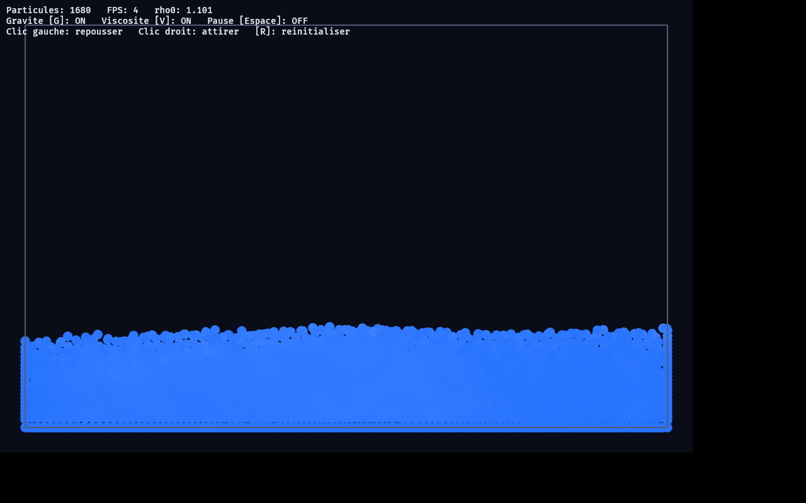

# bevy_sph_fluid

Simulation 2D de fluide par **SPH** (*Smoothed Particle Hydrodynamics*),
d'après Müller, Charypar & Gross 2003, *« Particle-Based Fluid Simulation for
Interactive Applications »*.

Le fluide est un nuage de particules dont la **densité**, la **pression** et la
**viscosité** sont estimées par noyaux de lissage. Sous gravité, les particules
forment une nappe de liquide que l'on peut bousculer à la souris.



## Lancer

```bash
cargo run -p bevy_sph_fluid --release
```

> Sous Linux, Bevy requiert quelques bibliothèques système (Vulkan, ALSA,
> udev, X11/Wayland, xkbcommon). Voir
> <https://github.com/bevyengine/bevy/blob/latest/docs/linux_dependencies.md>.

## Contrôles

| Touche / souris | Effet |
|-----------------|-------|
| `G` | activer / couper la gravité |
| `V` | activer / couper la viscosité |
| `Espace` | pause |
| `R` | réinitialiser la disposition |
| Clic gauche | repousser le fluide autour du curseur |
| Clic droit | attirer le fluide vers le curseur |

La couleur des particules code leur vitesse : bleu (au repos) → blanc (rapide).

## Architecture

Le cœur numérique (`physics::solver::Fluid`) est **découplé de l'ECS** : il
opère sur de simples `Vec<Vec2>`, ce qui le rend testable sans fenêtre. À
chaque pas :

1. **densité** `ρᵢ = Σⱼ m · W_poly6(rᵢⱼ)` ;
2. **pression** `pᵢ = max(0, k · (ρᵢ − ρ₀))` (clampée ⇒ pas de cohésion parasite) ;
3. **forces** pression (gradient du noyau *spiky*) + viscosité (laplacien) + gravité ;
4. **intégration** Euler semi-implicite, clamp de vitesse, contraintes de parois.

La recherche de voisins passe par une **grille uniforme** de cellule `H` (rayon
de lissage) : chaque particule ne consulte que les 3×3 cellules autour d'elle.

La densité de référence `ρ₀` est **calibrée** sur la disposition initiale (densité
maximale observée), ce qui rend les paramètres robustes aux changements
d'espacement ou de masse.

Le `FixedUpdate` tourne à 60 Hz et exécute plusieurs sous-pas par tick : avec une
équation d'état raide intégrée explicitement, le pas SPH doit rester petit pour
rester stable.

## Tests

```bash
cargo test -p bevy_sph_fluid --release
```

Outre les tests unitaires, le solveur est validé numériquement (sans GUI) :
absence de NaN/Inf, confinement dans la boîte, dépôt au fond et incompressibilité
du volume. Des tests `#[ignore]` (`diag_*`) servent au réglage des paramètres
physiques.
